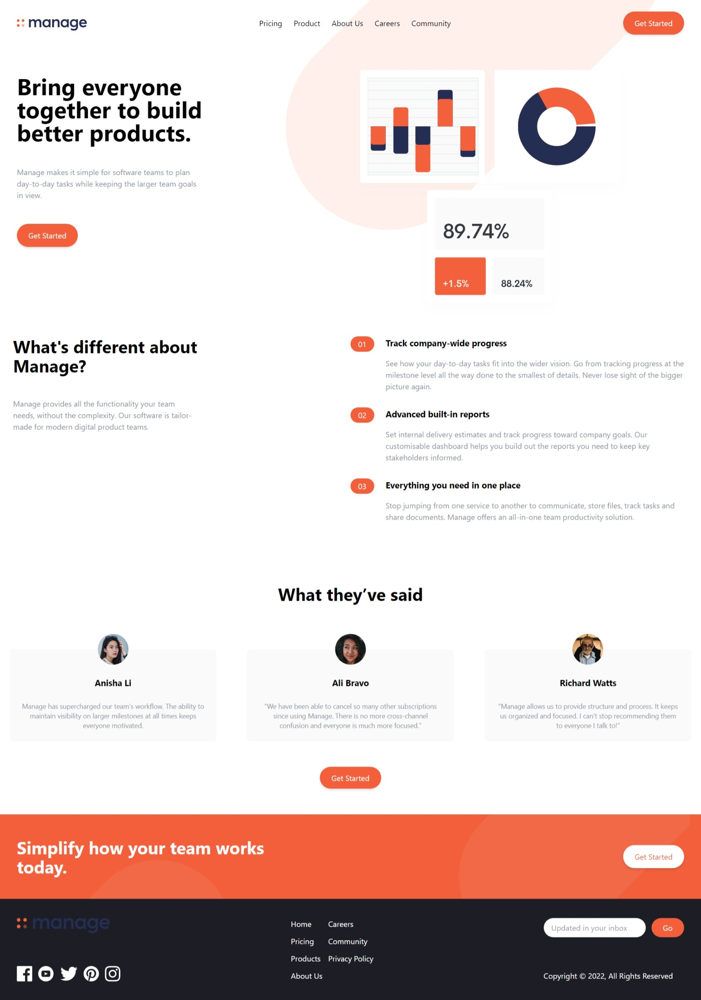

# Frontend Mentor - Manage landing page solution

This is a solution to the [Manage landing page challenge on Frontend Mentor](https://www.frontendmentor.io/challenges/manage-landing-page-SLXqC6P5). Frontend Mentor challenges help you improve your coding skills by building realistic projects. 

## Table of contents

- [Overview](#overview)
  - [The challenge](#the-challenge)
  - [Screenshot](#screenshot)
  - [Links](#links)
- [My process](#my-process)
  - [Built with](#built-with)
  - [Continued development](#continued-development)
 

## Overview

### The challenge

Users should be able to:

- View the optimal layout for the site depending on their device's screen size
- See hover states for all interactive elements on the page
y

### Screenshot

### Links

- Solution URL: [https://github.com/Min1870/manage-landing-page-master](https://github.com/Min1870/manage-landing-page-master)
- Live Site URL: [https://polite-mousse-f2f94b.netlify.app/](https://polite-mousse-f2f94b.netlify.app/)

## My process

### Built with

- Semantic HTML5 markup
- CSS custom properties
- Mobile-first workflow
- [React](https://reactjs.org/) - JS library

- [Tailwind](https://tailwindcss.com/) - For styles

### Continued development

- Carousel not included in testimonials section and I will try to add in future.

